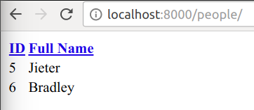

.. default-domain:: py

================================================
django-tables2 - An app for creating HTML tables
================================================

django-tables2 turns data into HTML tables. Features:

- Pagination
- Ordering
- Extendable
- Class based view
- Supports for queryset and list data
- Themes

Report bugs at http://github.com/bradleyayers/django-tables2/issues

.. toctree::
    :hidden:

    internal

Tutorial
========

1. ``pip install django-tables2``
2. Add ``'django_tables2'`` to ``INSTALLED_APPS``
3. Add ``'django.core.context_processors.request'`` to ``TEMPLATE_CONTEXT_PROCESSORS``

We're going to run through creating a tutorial app. Let's start with a simple model::

    # tutorial/models.py
    class Person(models.Model):
        name = models.CharField(verbose_name="full name")

Add some data so you have something to display in the table. Now write a view
to pass a ``Person`` queryset into a template::

    # tutorial/views.py
    from django.shortcuts import render

    def people(request):
        return render(request, "people.html", {"people": Person.objects.all()})

Finally, implement the template:

.. sourcecode:: django

    {# tutorial/templates/people.html #}
    
    <!doctype html>
    <html>
        <head>
            <link rel="stylesheet" href="{{ STATIC_URL }}django_tables2/themes/paleblue/css/screen.css" />
        </head>
        <body>
            
        </body>
    </html>

Hook the view up in your URLs, and load the page, you should see:

While simple, passing a queryset directly to ```` doesn't
allow for any customisation. For that, you must define a `.Table` class.

::

    # tutorial/tables.py
    import django_tables2 as tables
    from tutorial.models import Person

    class PersonTable(tables.Table):
        class Meta:
            model = Person
            # add class="paleblue" to <table> tag
            attrs = {"class": "paleblue"}

You'll then need to instantiate and configure the table in the view, before
adding it to the context.

::

    # tutorial/views.py
    from django.shortcuts import render
    from django_tables2   import RequestConfig
    from tutorial.models  import Person
    from tutorial.tables  import PersonTable

    def people(request):
        table = PersonTable(Person.objects.all())
        RequestConfig(request).configure(table)
        return render(request, 'people.html', {'table': table})

Using `.RequestConfig` automatically pulls values from ``request.GET`` and
updates the table accordingly. This enables data ordering and pagination.

Rather than passing a queryset to ````, instead pass the
table.

.. sourcecode:: django

    

.. note::

    ```` works best when it's used in a template that
    contains the current request in the context as ``request``. The easiest way
    to enable this, is to ensure that the ``TEMPLATE_CONTEXT_PROCESSORS``
    setting contains ``"django.core.context_processors.request"``.

At this point you haven't actually customised anything, you've merely added the
boilerplate code that ```` does for you when given a
queryset. The remaining sections in this document describe how to change
various aspects of the table.

.. _table-data:

Populating a table with data
============================

Tables are compatible with a range of input data structures. If you've seen the
tutorial you'll have seen a queryset being used, however any iterable that
supports :func:`len` and contains items that expose key-based accessed to
column values is fine.

An an example we'll demonstrate using list of dicts. When defining a table it's
necessary to declare each column. If your data matches the fields in a model,
columns can be declared automatically for you via the `Table.Meta.model`
option, but for non-queryset data you'll probably want to declare
them manually::

    import django_tables2 as tables

    data = [
        {"name": "Bradley"},
        {"name": "Stevie"},
    ]

    class NameTable(tables.Table):
        name = tables.Column()

    table = NameTable(data)

You can use this technique to override columns that were automatically created
via `Table.Meta.model` too::

    # models.py
    from django.db import models

    class Person(models.Model):
        name = models.CharField(max_length=200)

    # tables.py
    import django_tables2 as tables
    from .models import Person

    class PersonTable(tables.Table):
        name = tables.Column(verbose_name="full name")

        class Meta:
            model = Person

.. _accessors:

Specifying alternative data for a column
========================================

Each column has a "key" that describes which value to pull from each record to
populate the column's cells. By default, this key is just the name given to the
column, but it can be changed to allow foreign key traversal or other complex
cases.

To reduce ambiguity, rather than calling it a "key", it's been given the
special name "accessor".

Accessors are just dotted paths that describe how an object should be traversed
to reach a specific value. To demonstrate how they work we'll use them
directly::

    >>> from django_tables2 import A
    >>> data = {"abc": {"one": {"two": "three"}}}
    >>> A("abc.one.two").resolve(data)
    "three"

Dots represent a relationships, and are attempted in this order:

1. Dictionary lookup ``a[b]``
2. Attribute lookup ``a.b``
3. List index lookup ``a[int(b)]``

Then, if the value is callable, it is called and the result is used.

.. _order-by-accessors:

Specifying alternative ordering for a column
============================================

When using queryset data, it's possible for a column to present a computed
value that doesn't correspond to a column in the database. In this situation
attempting to order the column will cause a database exception.

Example::

    # models.py
    class Person(models.Model):
        first_name = models.CharField(max_length=200)
        family_name = models.CharField(max_length=200)

        @property
        def name(self):
            return u"%s %s" % (self.first_name, self.family_name)

    # tables.py
    class PersonTable(tables.Table):
        name = tables.Column()

::

    >>> table = PersonTable(Person.objects.all())
    >>> table.order_by = "name"
    >>> table.as_html()
    ...
    FieldError: Cannot resolve keyword u'name' into field. Choices are: first_name, family_name

The solution is to declare which fields should be used when ordering on via the
``order_by`` argument::

    # tables.py
    class PersonTable(tables.Table):
        name = tables.Column(order_by=("first_name", "family_name"))

Accessor syntax can be used for the values, but they must terminate on a model
field.

If ordering doesn't make sense for a particular column, it can be disabled via
the ``orderable`` argument::

    class SimpleTable(tables.Table):
        name = tables.Column()
        actions = tables.Column(orderable=False)

.. _swapping-columns:

Swapping the position of columns
================================

By default columns are positioned in the same order as they are declared,
however when mixing auto-generated columns (via `Table.Meta.model`) with
manually declared columns, the column sequence becomes ambiguous.

To resolve the ambiguity, columns sequence can be declared via the
`.Table.Meta.sequence` option::

    class PersonTable(tables.Table):
        selection = tables.CheckBoxColumn(accessor="pk", orderable=False)

        class Meta:
            model = Person
            sequence = ("selection", "first_name", "last_name")

The special value ``"..."`` can be used to indicate that any omitted columns
should inserted at that location. As such it can be used at most once.

.. _column-headers:

Customising column headings
===========================

The header cell for each column comes from `~.Column.header`. By default this
method returns a titlised version of the `~.Column.verbose_name`.

When using queryset data and a verbose name hasn't been explicitly
defined for a column, the corresponding model field's verbose name will be
used.

Consider the following:

    >>> class Person(models.Model):
    ...     first_name = models.CharField(verbose_name='model verbose name', max_length=200)
    ...     last_name = models.CharField(max_length=200)
    ...     region = models.ForeignKey('Region')
    ...
    >>> class Region(models.Model):
    ...     name = models.CharField(max_length=200)
    ...
    >>> class PersonTable(tables.Table):
    ...     first_name = tables.Column()
    ...     ln = tables.Column(accessor='last_name')
    ...     region_name = tables.Column(accessor='region.name')
    ...
    >>> table = PersonTable(Person.objects.all())
    >>> table.columns['first_name'].header
    u'Model Verbose Name'
    >>> table.columns['ln'].header
    u'Last Name'
    >>> table.columns['region_name'].header
    u'Name'

As you can see in the last example (region name), the results are not always
desirable when an accessor is used to cross relationships. To get around this
be careful to define `.Column.verbose_name`.

.. _pagination:

Pagination
==========

Pagination is easy, just call :meth:`.Table.paginate` and
pass in the current page number, e.g.

.. sourcecode:: python

    def people_listing(request):
        table = PeopleTable(Person.objects.all())
        table.paginate(page=request.GET.get('page', 1), per_page=25)
        return render(request, 'people_listing.html', {'table': table})

If you're using `.RequestConfig`, pass pagination options to the constructor,
e.g.:

.. sourcecode:: python

    def people_listing(request):
        table = PeopleTable(Person.objects.all())
        RequestConfig(request, paginate={"per_page": 25}).configure(table)
        return render(request, 'people_listing.html', {'table': table})

.. _custom-rendering:

Custom rendering
================

Various options are available for changing the way the table is :term:`rendered
<render>`. Each approach has a different balance of ease-of-use and
flexibility.

.. _table.render_foo:

:meth:`Table.render_FOO` methods
--------------------------------

To change how a column is rendered, implement a ``render_FOO`` method on the
table (where ``FOO`` is the :term:`column name`). This approach is suitable if
you have a one-off change that you don't want to use in multiple tables.

Supported keyword arguments include:

- ``record`` -- the entire record for the row from the :term:`table data`
- ``value`` -- the value for the cell retrieved from the :term:`table data`
- ``column`` -- the `.Column` object
- ``bound_column`` -- the `.BoundColumn` object
- ``bound_row`` -- the `.BoundRow` object
- ``table`` -- alias for ``self``

Here's an example where the first column displays the current row number::

    >>> import django_tables2 as tables
    >>> import itertools
    >>> class SimpleTable(tables.Table):
    ...     row_number = tables.Column(empty_values=())
    ...     id = tables.Column()
    ...     age = tables.Column()
    ...
    ...     def __init__(self, *args, **kwargs):
    ...         super(SimpleTable, self).__init__(*args, **kwargs)
    ...         self.counter = itertools.count()
    ...
    ...     def render_row_number(self):
    ...         return 'Row %d' % next(self.counter)
    ...
    ...     def render_id(self, value):
    ...         return '<%s>' % value
    ...
    >>> table = SimpleTable([{'age': 31, 'id': 10}, {'age': 34, 'id': 11}])
    >>> for cell in table.rows[0]:
    ...     print cell
    ...
    Row 0
    <10>
    31

Python's `inspect.getargspec` is used to only pass the arguments declared by the
function. This means it's not necessary to add a catch all (``**``) keyword
argument.

.. important::

    `render` methods are *only* called if the value for a cell is determined to
    be not an :term:`empty value`. When a value is in `.Column.empty_values`,
    a default value is rendered instead (both `.Column.render` and
    ``Table.render_FOO`` are skipped).

.. _subclassing-column:

Subclassing `.Column`
---------------------

Defining a column subclass allows functionality to be reused across tables.
Columns have a `render` method that behaves the same as :ref:`table.render_foo`
methods on tables::

    >>> import django_tables2 as tables
    >>>
    >>> class UpperColumn(tables.Column):
    ...     def render(self, value):
    ...         return value.upper()
    ...
    >>> class Example(tables.Table):
    ...     normal = tables.Column()
    ...     upper = UpperColumn()
    ...
    >>> data = [{'normal': 'Hi there!',
    ...          'upper':  'Hi there!'}]
    ...
    >>> table = Example(data)
    >>> table.as_html()
    u'<table><thead><tr><th>Normal</th><th>Upper</th></tr></thead><tbody><tr><td>Hi there!</td><td>HI THERE!</td></tr></tbody></table>\n'

See :ref:`table.render_foo` for a list of arguments that can be accepted.

For complicated columns, you may want to return HTML from the
:meth:`~Column.render` method. This is fine, but be sure to mark the string as
safe to avoid it being escaped::

    >>> from django.utils.safestring import mark_safe
    >>> from django.utils.html import escape
    >>>
    >>> class ImageColumn(tables.Column):
    ...     def render(self, value):
    ...         return mark_safe(''
    ...                          % escape(value))
    ...

.. _css:

CSS
---

In order to use CSS to style a table, you'll probably want to add a
``class`` or ``id`` attribute to the ``<table>`` element. django-tables2 has
a hook that allows abitrary attributes to be added to the ``<table>`` tag.

.. sourcecode:: python

    >>> import django_tables2 as tables
    >>> class SimpleTable(tables.Table):
    ...     id = tables.Column()
    ...     age = tables.Column()
    ...
    ...     class Meta:
    ...         attrs = {'class': 'mytable'}
    ...
    >>> table = SimpleTable()
    >>> table.as_html()
    '<table class="mytable">...'

.. _custom-template:

Custom Template
---------------

And of course if you want full control over the way the table is rendered,
ignore the built-in generation tools, and instead pass an instance of your
`.Table` subclass into your own template, and render it yourself.

Have a look at the ``django_tables2/table.html`` template for an example.

.. _query-string-fields:

Querystring fields
==================

Tables pass data via the querystring to indicate ordering and pagination
preferences.

The names of the querystring variables are configurable via the options:

- ``order_by_field`` -- default: ``"sort"``
- ``page_field`` -- default: ``"page"``
- ``per_page_field`` -- default: ``"per_page"``, **note:** this field currently
  isn't used by ````

Each of these can be specified in three places:

- ``Table.Meta.foo``
- ``Table(..., foo=...)``
- ``Table(...).foo = ...``

If you're using multiple tables on a single page, you'll want to prefix these
fields with a table-specific name. e.g.

.. sourcecode:: python

    def people_listing(request):
        config = RequestConfig(request)
        table1 = PeopleTable(Person.objects.all(), prefix="1-")  # prefix specified
        table2 = PeopleTable(Person.objects.all(), prefix="2-")  # prefix specified
        config.configure(table1)
        config.configure(table2)
        return render(request, "people_listing.html",
                      {"table1": table1, "table2": table2})

.. _column-attributes:

Column attributes
=================

Column attributes can be specified using the `dict` with specific keys.
The dict defines HTML attributes for one of more elements within the column.
Depending on the column, different elements are supported, however ``th``,
``td``, and ``cell`` are supported universally.

e.g.

.. sourcecode:: python

    >>> import django_tables2 as tables
    >>>
    >>> class SimpleTable(tables.Table):
    ...     name = tables.Column(attrs={"th": {"id": "foo"}})
    ...
    >>> SimpleTable(data).as_html()
    "{snip}<thead><tr><th id="foo" class="name">{snip}<tbody><tr><td class="name">{snip}"

``th`` and ``td`` are special cases because they're extended during rendering
to add the column name as a class. This is done to make writing CSS easier.
Have a look at each column's API reference to find which elements are
supported.

.. _builtin-columns:

Built-in columns
================

For common use-cases the following columns are included:

- `.BooleanColumn` -- renders boolean values
- `.Column` -- generic column
- `.CheckBoxColumn` -- renders checkbox form inputs
- `.DateColumn` -- date formatting
- `.DateTimeColumn` -- datetime formatting in the local timezone
- `.FileColumn` -- renders files as links
- `.EmailColumn` -- renders ``<a href="mailto:...">`` tags
- `.LinkColumn` -- renders ``<a href="...">`` tags (compose a django url)
- `.TemplateColumn` -- renders template code
- `.URLColumn` -- renders ``<a href="...">`` tags (absolute url)

.. _template_tags:

Template tags
=============

.. _template-tags.render_table:

render_table
------------

Renders a `~django_tables2.tables.Table` object to HTML and enables as
many features in the output as possible.

.. sourcecode:: django

    
    

    {# Alternatively a specific template can be used #}
    

If the second argument (template path) is given, the template will be rendered
with a `.RequestContext` and the table will be in the variable ``table``.

.. note::

    This tag temporarily modifies the `.Table` object during rendering. A
    ``context`` attribute is added to the table, providing columns with access
    to the current context for their own rendering (e.g. `.TemplateColumn`).

This tag requires that the template in which it's rendered contains the
`~.http.HttpRequest` inside a ``request`` variable. This can be achieved by
ensuring the ``TEMPLATE_CONTEXT_PROCESSORS`` setting contains
``"django.core.context_processors.request"``. By default it is not included,
and the setting itself is not even defined within your project's
``settings.py``. To resolve this add the following to your ``settings.py``:

.. sourcecode:: python

    from django.conf.global_settings import TEMPLATE_CONTEXT_PROCESSORS
    TEMPLATE_CONTEXT_PROCESSORS += ('django.core.context_processors.request',)

.. _template-tags.querystring:

querystring
-----------

A utility that allows you to update a portion of the query-string without
overwriting the entire thing.

Let's assume we have the querystring ``?search=pirates&sort=name&page=5`` and
we want to update the ``sort`` parameter:

.. sourcecode:: django

               # ?search=pirates&sort=dob&page=5
                  # ?search=pirates&page=5
      # ?page=5

                   # supports variables as keys
               # ?search=robots&page=5
    

This tag requires the ``django.core.context_processors.request`` context
processor, see :ref:`template-tags.render_table`.

Template filters
================

title
-----

String filter that performs title case conversion on a per-word basis, leaving
words containing upper-case letters alone.

.. sourcecode:: django

    {{ "start 6PM"|title }}   # Start 6PM
    {{ "sTart 6pm"|title }}   # sTart 6pm

.. warning::

    Be careful when loading the ``django_tables2`` template library to not
    in advertantly load ``title``. You should always use the
    ```` syntax.

Class Based Generic Mixins
==========================

Django 1.3 introduced `class based views`__ as a mechanism to reduce the
repetition in view code. django-tables2 comes with a single class based view
mixin: `.SingleTableMixin`. It makes it trivial to incorporate a table into a
view/template.

The following view parameters are supported:

- ``table_class`` –- the table class to use, e.g. ``SimpleTable``
- ``table_data`` (or ``get_table_data()``) -- the data used to populate the table
- ``context_table_name`` -- the name of template variable containing the table object
- ``table_pagination`` -- pagination options to pass to `.RequestConfig`

.. __: https://docs.djangoproject.com/en/1.3/topics/class-based-views/

For example:

.. sourcecode:: python

    from django_tables2 import SingleTableView

    class Person(models.Model):
        first_name = models.CharField(max_length=200)
        last_name = models.CharField(max_length=200)

    class PersonTable(tables.Table):
        class Meta:
            model = Simple

    class PersonList(SingleTableView):
        model = Person
        table_class = PersonTable

The template could then be as simple as:

.. sourcecode:: django

    
    

Such little code is possible due to the example above taking advantage of
default values and `.SimpleTableMixin`'s eagarness at finding data sources
when one isn't explicitly defined.

.. note::

    If you need more than one table on a page, use `.SingleTableView` and use
    `.get_context_data` to initialise the other tables and add them to the
    context.

.. note::

    You don't have to base your view on `ListView`, you're able to mix
    `SingleTableMixin` directly.

Table Mixins
============

It's possible to create a mixin for a table that overrides something, however
unless it itself is a subclass of `.Table` class variable instances of
`.Column` will **not** be added to the class which is using the mixin.

Example::

    >>> class UselessMixin(object):
    ...     extra = tables.Column()
    ...
    >>> class TestTable(UselessMixin, tables.Table):
    ...     name = tables.Column()
    ...
    >>> TestTable.base_columns.keys()
    ['name']

To have a mixin contribute a column, it needs to be a subclass of
`~django_tables2.tables.Table`. With this in mind the previous example
*should* have been written as follows::

    >>> class UsefulMixin(tables.Table):
    ...     extra = tables.Column()
    ...
    >>> class TestTable(UsefulMixin, tables.Table):
    ...     name = tables.Column()
    ...
    >>> TestTable.base_columns.keys()
    ['extra', 'name']

.. _tables-for-models:

Tables for models
=================

If you build use tables to display `.QuerySet` data, rather than defining each
column manually in the table, the `.Table.Meta.model` option allows tables to
be dynamically created based on a model::

    # models.py
    class Person(models.Model):
        first_name = models.CharField(max_length=200)
        last_name = models.CharField(max_length=200)
        user = models.ForeignKey("auth.User")
        dob = models.DateField()

    # tables.py
    class PersonTable(tables.Table):
        class Meta:
            model = Person

This has a number of benefits:

- Less code, easier to write, more DRY
- Columns use the field's `~.models.Field.verbose_name`
- Specialised columns are used where possible (e.g. `.DateColumn` for a
  `~.models.DateField`)

When using this approach, the following options are useful:

- `~.Table.Meta.sequence` -- reorder columns
- `~.Table.Meta.fields` -- specify model fields to *include*
- `~.Table.Meta.exclude` -- specify model fields to *exclude*

.. _localization-control:

Controlling localization
========================

.. note::
    This functionality doesn't work in Django prior to version 1.3

Django_tables2 allows you to define which column of a table should or should not
be localized. For example you may want to use this feature in following use cases:

* You want to format some columns representing for example numeric values in the given locales
  even if you don't enable `USE_L10N` in your settings file.

* You don't want to format primary key values in your table
  even if you enabled `USE_L10N` in your settings file.

This control is done by using two filter functions in Django's `l10n` library
named `localize` and `unlocalize`. Check out Django docs about
:ref:`localization <django:format-localization>` for more information about them.

There are two ways of controling localization in your columns.

First one is setting the `~.Column.localize` attribute in your column definition
to `True` or `False`. Like so::

     class PersonTable(tables.Table):
        id = tables.Column(name="id", accessor="pk", localize=False)
        class Meta:
            model = Person

.. note::
    The default value of the `localize` attribute is `None` which means the formatting
    of columns is dependant from the `USE_L10N` setting.

The second way is to define a `~.Table.Meta.localize` and/or `~.Table.Meta.unlocalize`
tuples in your tables Meta class (jutst like with `~.Table.Meta.fields`
or `~.Table.Meta.exclude`). You can do this like so::

     class PersonTable(tables.Table):
        id = tables.Column(accessor="pk")
        value = tables.Column(accessor="some_numerical_field")
        class Meta:
            model = Person
            unlocalize = ('id',)
            localize = ('value',)

If you define the same column in both `localize` and `unlocalize` then the value
of this column will be "unlocalized" which means that `unlocalize` has higher precedence.

API Reference
=============

`.Accessor` (`.A`)
------------------

.. autoclass:: django_tables2.utils.Accessor

`.RequestConfig`
----------------

.. autoclass:: django_tables2.config.RequestConfig

`.Table`
--------

.. autoclass:: django_tables2.tables.Table
    :members: paginate, as_html

`.Table.Meta`
-------------

.. class:: Table.Meta

    Provides a way to define *global* settings for table, as opposed to
    defining them for each instance.

    .. attribute:: attrs

        Allows custom HTML attributes to be specified which will be added to
        the ``<table>`` tag of any table rendered via
        :meth:`.Table.as_html` or the
        :ref:`template-tags.render_table` template tag.

        :type: `dict`
        :default: ``{}``

        This is typically used to enable a theme for a table (which is done by
        adding a CSS class to the ``<table>`` element). i.e.::

            class SimpleTable(tables.Table):
                name = tables.Column()

                class Meta:
                    attrs = {"class": "paleblue"}

        .. versionadded:: 0.15.0

        It's possible to use callables to create *dynamic* values. A few caveats:

        - It's not supported for ``dict`` keys, i.e. only values.
        - All values will be resolved on table instantiation.

        Consider this example where a unique ``id`` is given to each instance
        of the table::

            import itertools
            counter = itertools.count()

            class UniqueIdTable(tables.Table):
                name = tables.Column()

                class Meta:
                    attrs = {"id": lambda: "table_%d" % next(counter)}

        .. note::

            This functionality is also available via the ``attrs`` keyword
            argument to a table's constructor.

    .. attribute:: empty_text

        Defines the text to display when the table has no rows.

        :type: `unicode`
        :default: `None`

        If the table is empty and ``bool(empty_text)`` is `True`, a row is
        displayed containing ``empty_text``. This is allows a message such as
        *There are currently no FOO.* to be displayed.

        .. note::

            This functionality is also available via the ``empty_text`` keyword
            argument to a table's constructor.

    .. attribute:: exclude

        Defines which columns should be excluded from the table. This is useful
        in subclasses to exclude columns in a parent.

        :type: tuple of `unicode`
        :default: ``()``

        Example::

            >>> class Person(tables.Table):
            ...     first_name = tables.Column()
            ...     last_name = tables.Column()
            ...
            >>> Person.base_columns
            {'first_name': <django_tables2.columns.Column object at 0x10046df10>,
            'last_name': <django_tables2.columns.Column object at 0x10046d8d0>}
            >>> class ForgetfulPerson(Person):
            ...     class Meta:
            ...         exclude = ("last_name", )
            ...
            >>> ForgetfulPerson.base_columns
            {'first_name': <django_tables2.columns.Column object at 0x10046df10>}

        .. note::

            This functionality is also available via the ``exclude`` keyword
            argument to a table's constructor.

            However, unlike some of the other `.Table.Meta` options, providing the
            ``exclude`` keyword to a table's constructor **won't override** the
            `.Meta.exclude`. Instead, it will be effectively be *added*
            to it. i.e. you can't use the constructor's ``exclude`` argument to
            *undo* an exclusion.

    .. attribute:: fields

        Used in conjunction with `~.Table.Meta.model`, specifies which fields
        should have columns in the table.

        :type: tuple of `unicode` or `None`
        :default: `None`

        If `None`, all fields are used, otherwise only those named.

        Example::

            # models.py
            class Person(models.Model):
                first_name = models.CharField(max_length=200)
                last_name = models.CharField(max_length=200)

            # tables.py
            class PersonTable(tables.Table):
                class Meta:
                    model = Person
                    fields = ("first_name", )

    .. attribute:: model

        A model to inspect and automatically create corresponding columns.

        :type: Django model
        :default: `None`

        This option allows a Django model to be specified to cause the table to
        automatically generate columns that correspond to the fields in a
        model.

    .. attribute:: order_by

        The default ordering. e.g. ``('name', '-age')``. A hyphen ``-`` can be
        used to prefix a column name to indicate *descending* order.

        :type: `tuple`
        :default: ``()``

        .. note::

            This functionality is also available via the ``order_by`` keyword
            argument to a table's constructor.

    .. attribute:: sequence

        The sequence of the table columns. This allows the default order of
        columns (the order they were defined in the Table) to be overridden.

        :type: any iterable (e.g. `tuple` or `list`)
        :default: ``()``

        The special item ``"..."`` can be used as a placeholder that will be
        replaced with all the columns that weren't explicitly listed. This
        allows you to add columns to the front or back when using inheritence.

        Example::

            >>> class Person(tables.Table):
            ...     first_name = tables.Column()
            ...     last_name = tables.Column()
            ...
            ...     class Meta:
            ...         sequence = ("last_name", "...")
            ...
            >>> Person.base_columns.keys()
            ['last_name', 'first_name']

        The ``"..."`` item can be used at most once in the sequence value. If
        it's not used, every column *must* be explicitly included. e.g. in the
        above example, ``sequence = ("last_name", )`` would be **invalid**
        because neither ``"..."`` or ``"first_name"`` were included.

        .. note::

            This functionality is also available via the ``sequence`` keyword
            argument to a table's constructor.

    .. attribute:: orderable

        Default value for column's *orderable* attribute.

        :type: `bool`
        :default: `True`

        If the table and column don't specify a value, a column's
        ``orderable`` value will fallback to this. object specify. This
        provides an easy mechanism to disable ordering on an entire table,
        without adding ``orderable=False`` to each column in a table.

        .. note::

            This functionality is also available via the ``orderable`` keyword
            argument to a table's constructor.

    .. attribute:: template

        The default template to use when rendering the table.

        :type: `unicode`
        :default: ``"django_tables2/table.html"``

        .. note::

            This functionality is also available via the *template* keyword
            argument to a table's constructor.

    .. attribute:: localize

        Specifies which fields should be localized in the table.
        Read :ref:`localization-control` for more information.

        :type: tuple of `unicode`
        :default: empty tuple

    .. attribute:: unlocalize

        Specifies which fields should be unlocalized in the table.
        Read :ref:`localization-control` for more information.

        :type: tuple of `unicode`
        :default: empty tuple

`.BooleanColumn`
----------------

.. autoclass:: django_tables2.columns.BooleanColumn

`.Column`
---------

.. autoclass:: django_tables2.columns.Column

`.CheckBoxColumn`
-----------------

.. autoclass:: django_tables2.columns.CheckBoxColumn
    :members:

`.DateColumn`
-------------

.. autoclass:: django_tables2.columns.DateColumn
    :members:

`.DateTimeColumn`
-----------------

.. autoclass:: django_tables2.columns.DateTimeColumn
    :members:

`.EmailColumn`
--------------

.. autoclass:: django_tables2.columns.EmailColumn
    :members:

`.FileColumn`
-------------

.. autoclass:: django_tables2.columns.FileColumn
    :members:

`.LinkColumn`
-------------

.. autoclass:: django_tables2.columns.LinkColumn
    :members:

`.TemplateColumn`
-----------------

.. autoclass:: django_tables2.columns.TemplateColumn
    :members:

`.URLColumn`
------------

.. autoclass:: django_tables2.columns.URLColumn
    :members:

See :doc:`internal` for internal classes.

Upgrading from django-tables Version 1
======================================

- Change your ``INSTALLLED_APPS`` entry from ``"django_tables.app"`` to
  ``"django_tables2"``.

- Change all your import references from ``django_tables`` to
  ``django_tables2``.

- Replace all references to the old ``MemoryTable`` and ``ModelTable``
  classes with simply ``Table``.

- In your templates, load the ``django_tables2`` template library;
  ```` instead of ````.

- A table object is no longer iterable; rather than ``for row in table``,
  instead you now do explicitly: ``for row in table.rows``.

- If you were using ``row.data`` to access a row's underlying data,
  replace it with ``row.record`` instead.

- When declaring columns, replace the use of::

    name_in_dataset = tables.Column(name="wanted_column_name")

  with::

    wanted_column_name = tables.Column(accessor="name_in_dataset")

- When declaring columns, replace the use of::

     column_to_override = tables.Column(name="wanted_column_name", data="name_in_dataset")

  with::

     wanted_column_name = tables.Column(accessor="name_in_dataset")

  and exclude ``column_to_override`` via the table meta data.

- When generating the link to order the column, instead of:

  .. sourcecode:: django

      

  use:

  .. sourcecode:: django

      

- Replace:

  .. sourcecode:: django

      {{ column.is_ordered_reverse }} and {{ column.is_ordered_straight }}

  with:

  .. sourcecode:: django

      {{ column.order_by.is_descending }} and {{ column.order_by.is_ascending }}

Glossary
========

.. glossary::

    accessor
        Refers to an `.Accessor` object

    column name
        The name given to a column. In the follow example, the *column name* is
        ``age``.

        .. sourcecode:: python

            class SimpleTable(tables.Table):
                age = tables.Column()

    empty value
        An empty value is synonymous with "no value". Columns have an
        ``empty_values`` attribute that contains values that are considered
        empty. It's a way to declare which values from the database correspond
        to *null*/*blank*/*missing* etc.

    order by alias
        A prefixed column name that describes how a column should impact the
        order of data within the table. This allows the implementation of how
        a column affects ordering to be abstracted, which is useful (e.g. in
        querystrings).

        .. sourcecode:: python

            class ExampleTable(tables.Table):
                name = tables.Column(order_by=('first_name', 'last_name'))

        In this example ``-name`` and ``name`` are valid order by aliases. In
        a querystring you might then have ``?order=-name``.

    table
        The traditional concept of a table. i.e. a grid of rows and columns
        containing data.

    view
        A Django view.

    record
        A single Python object used as the data for a single row.

    render
        The act of serialising a `.Table` into
        HTML.

    template
        A Django template.

    table data
        An interable of :term:`records <record>` that
        `.Table` uses to populate its rows.
